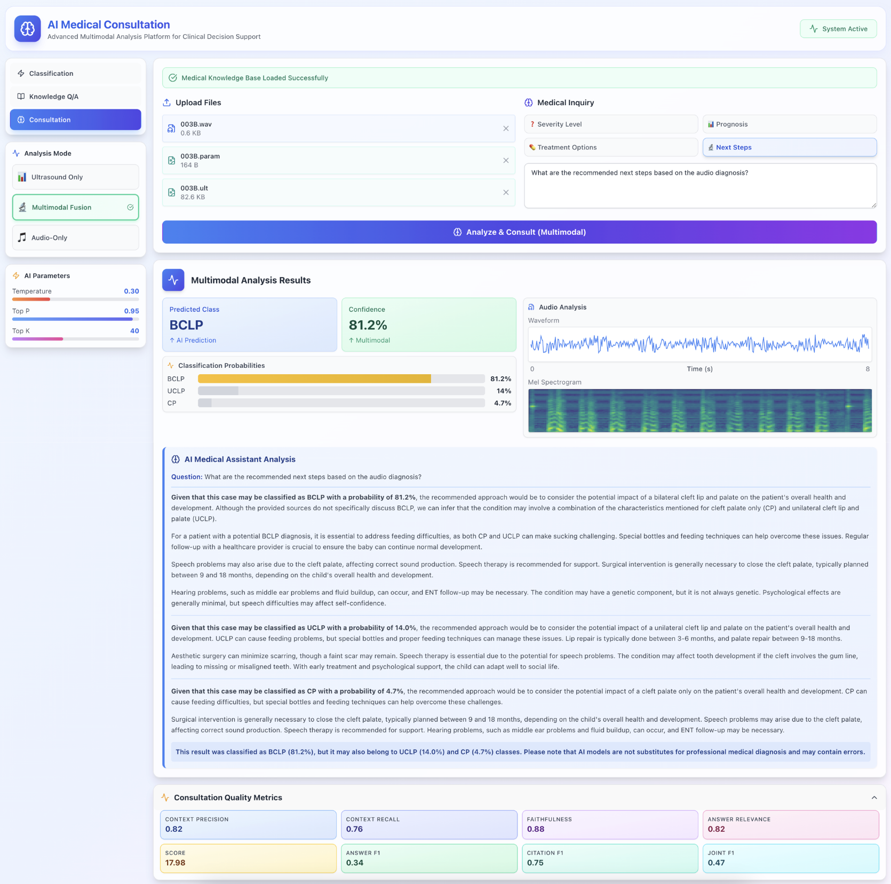
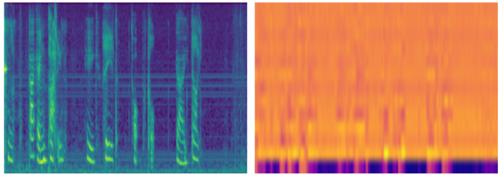
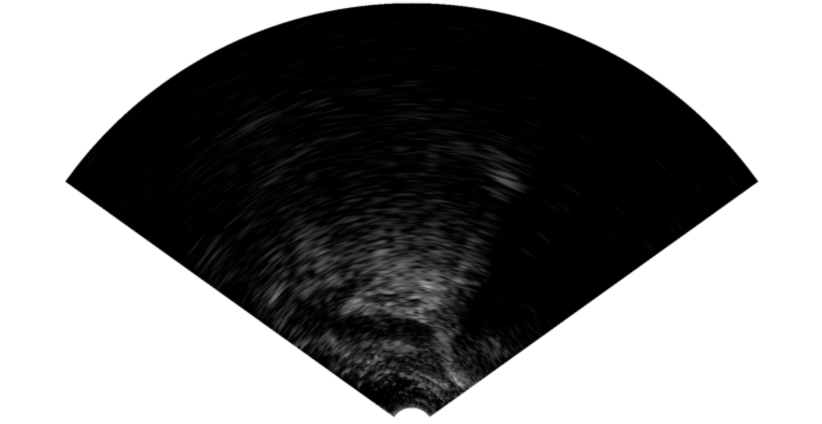
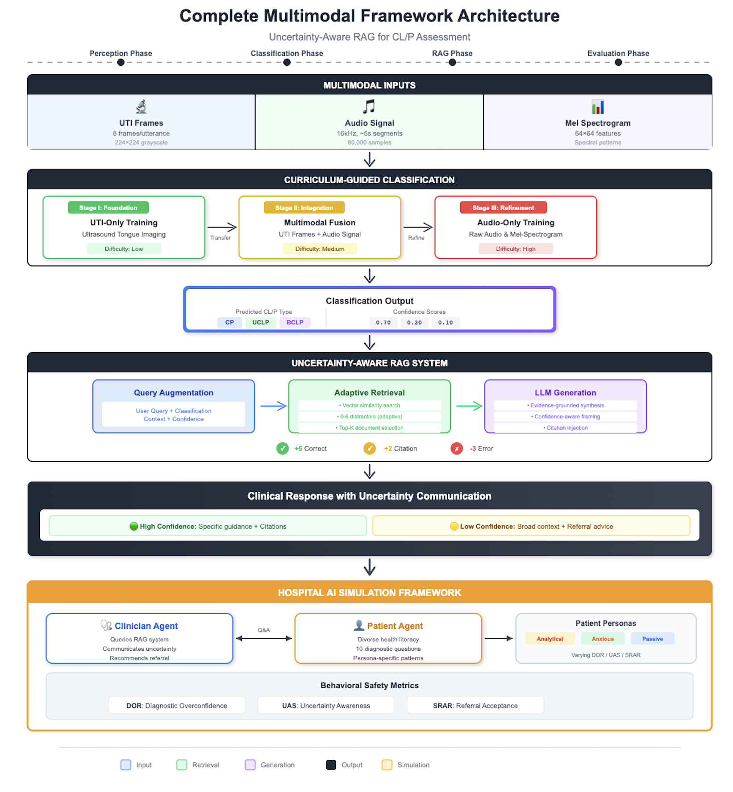

# Uncertainty-Aware Multimodal RAG for Safe Medical Question-Answering in Cleft Lip and Palate Assessment

  
  
  
  

  <b>🔬 Official implementation of our IEEE Access 2026 paper</b>

---

## 📢 Code Availability Notice

> **⚠️ The source code will be released upon paper publication.**
>
> We are currently in the peer review process. Once the paper is officially published in IEEE Access, the complete codebase including training scripts, model weights, and evaluation pipelines will be made publicly available.
>
> **Expected release: After publication acceptance**

---

## 📄 Paper

**Uncertainty-Aware Multimodal RAG for Safe Medical Question-Answering in Cleft Lip and Palate Assessment**

*Sevval Ilhan1,2, Ilhan Aytutuldu2, and Yusuf Sinan Akgul2*

1Department of Information Systems and Technology, Okan University, Istanbul, Turkey  
2Department of Computer Engineering, Gebze Technical University, Kocaeli, Turkey

---

## 🎯 Abstract

Medical question–answering systems that integrate multimodal perception with large language models are particularly prone to hallucinations under high predictive uncertainty. This work proposes an **uncertainty-aware multimodal retrieval-augmented generation (RAG) framework** for cleft lip and palate (CL/P) assessment that explicitly propagates classification confidence through both evidence retrieval and response generation.

### Key Contributions

- 🔹 **Multimodal CL/P Classification**: Combining ultrasound tongue imaging (UTI) and acoustic features with curriculum-guided learning
- 🔹 **Uncertainty-Aware RAG**: Confidence-weighted retrieval and generation for safer medical QA
- 🔹 **Hospital AI Simulation**: Persona-driven evaluation framework for behavioral safety assessment
- 🔹 **Clinical Decision Support**: Responsible AI design that communicates uncertainty and recommends specialist referral

---

## 🖥️ System Interface

  

*Figure: The AI Medical Consultation platform showing real-time multimodal analysis with uncertainty-aware RAG-based clinical responses.*

---

## 📊 Data Modalities

### Mel Spectrogram Features

  

*Mel spectrogram representations capturing acoustic patterns related to resonance and hypernasality in CL/P speech.*

### Ultrasound Tongue Imaging (UTI)

  

*Midsagittal ultrasound tongue image showing articulatory dynamics for speech analysis.*

---

## 🏗️ Framework Architecture

  

## 📈 Key Results

### Classification Performance (Audio-only with Curriculum Learning)

| Model | Accuracy | Precision | Recall | F1-Score |
|-------|----------|-----------|--------|----------|
| CNN+LSTM | **0.89** | 0.87 | 0.90 | **0.89** |
| Vision Transformer | 0.86 | 0.85 | 0.85 | 0.85 |
| ResNet3D + Attention | 0.85 | 0.83 | 0.81 | 0.81 |

### RAG Performance Comparison

| Approach | Context Precision | Faithfulness | Joint F1 |
|----------|------------------|--------------|----------|
| Naive RAG | 0.71 | 0.81 | 0.34 |
| Adaptive RAG | 0.75 | 0.84 | 0.44 |
| Classification-Aware | 0.81 | 0.87 | 0.47 |
| **Uncertainty-Aware** | **0.86** | **0.90** | **0.49** |

---

## 📚 Dataset

This work uses the **UltraSuite CLEFT** dataset:

> Eshky, A., et al. "UltraSuite: A repository of ultrasound and acoustic data from child speech therapy sessions." *arXiv preprint arXiv:1907.00835*, 2019.

**Dataset Access:** [UltraSuite Repository](https://ultrasuite.github.io/)

---

## 🤝 Authors

<table>
  <tr>
    <td align="center">
      <b>Sevval Ilhan</b> 
      Okan University & GTU 
      <a href="mailto:sevval.ilhan@okan.edu.tr">📧 Email</a>
    </td>
    <td align="center">
      <b>Ilhan Aytutuldu</b> 
      Gebze Technical University 
      <a href="mailto:iaytutuldu@gtu.edu.tr">📧 Email</a>
    </td>
    <td align="center">
      <b>Yusuf Sinan Akgul</b> 
      Gebze Technical University 
      <a href="mailto:akgul@gtu.edu.tr">📧 Email</a>
    </td>
  </tr>
</table>

---

## 📜 License

This project is licensed under the MIT License - see the [LICENSE](LICENSE) file for details.

---

## 🙏 Acknowledgments

- [UltraSuite](https://ultrasuite.github.io/) for providing the CLEFT dataset

---

  <b>⭐ Star this repository if you find it helpful!</b>

  <i>For questions and collaboration inquiries, please contact the authors.</i>

